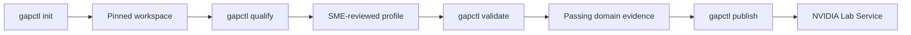
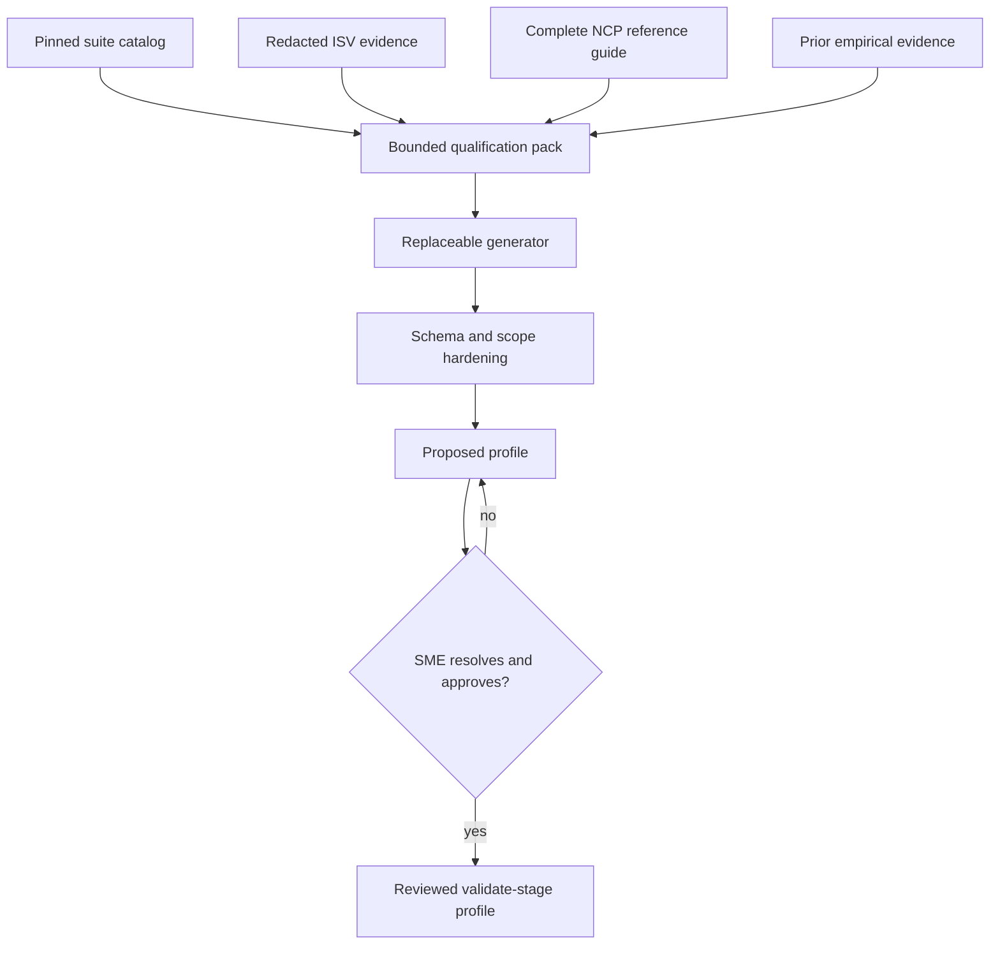
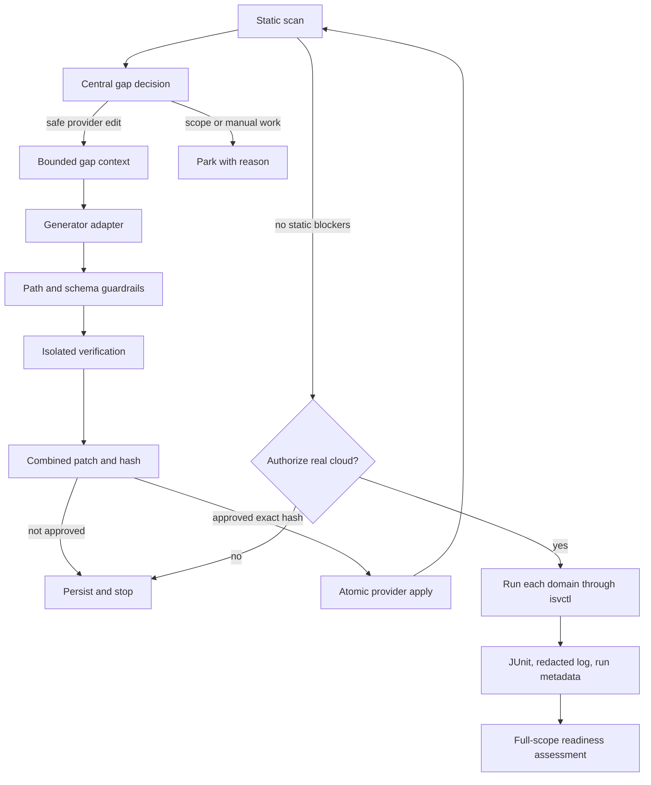

# Architecture

`gapctl` presents one product journey to an infrastructure ISV:

```text
init -> qualify -> validate -> publish
```

The implementation has multiple deterministic services because review,
verification, rollback, evidence preservation, and scope enforcement are safety
boundaries. Those services are not separate user workflows or public commands.

## Command ownership



### `init`

`init` owns all workspace bootstrap work:

1. validate provider, domain, API, and credential-name inputs;
2. clone `ai-cloud-validation` when the checkout is absent;
3. resolve and record the exact validation commit;
4. build the per-domain suite catalog through the installed `isvctl` contract;
5. scaffold provider-owned files;
6. import declared context into the redacted cache;
7. create the initial draft profile.

The cache index is bound to both the declared source configuration and the
current bytes of local sources. If an ISV edits a local API specification or
qualification document before proposal generation, `qualify` refreshes that
source instead of sending stale evidence to the generator. This freshness
check never performs hidden network requests.

A fresh clone obtains the current head of the selected ref. Once recorded, the
commit is stable for that qualification. Later commands reject checkout drift
instead of silently pulling different tests into an active engagement.

### `qualify`

`qualify` is a resumable human decision:



The generator maps capabilities explicitly declared by the ISV to the closest
applicable pinned checks and can suggest component mappings, coverage, and
ownership. An API specification is authoritative for the interfaces the ISV
declares, not proof that those interfaces work. The deterministic layer forces
the proposal to remain a qualify-stage draft and requires its domains to equal
the domains declared during `init`. The SME edits the proposal when facts are
unresolved. Only an explicit approval promotes the reviewed document.

Qualification receives the complete NCP Software Reference Guide collection
published in NVIDIA's documentation index. The collection is required and is
accepted only when every indexed guide page is fetched. Suite catalogs,
authoritative ISV evidence, and that reference collection are never silently
shortened: packing fails closed when the configured limit cannot hold them.
GitHub issues are not a supported qualification source.

The profile is deliberately small:

- a `covered/test` domain default is allowed only when ISV evidence maps every
  check in that pinned domain catalog;
- partial domains use grouped capability entries for explicitly mapped checks
  instead of silently treating unmatched checks as covered;
- grouped selectors require evidence for every selected check's actual behavior;
  nearby terminology is not a capability match;
- selectors account for both the provider step and validation class; a
  class-only selector is valid only when every occurrence of that class is
  supported;
- an `out_of_scope/skip` partial-domain default requires evidence that every
  unmatched check is outside the product claim; otherwise it remains an SME
  decision;
- `covered/test` means the capability exists and should be tested;
- `out_of_scope/skip` is an explicit reviewed scope decision;
- `unknown`, `gap`, `evidence`, and `deferred` block entry into validation.

Missing live evidence does not by itself make a declared capability unknown.
Qualification routes it to `covered/test`; validation determines whether the
target implementation passes. Numeric `nsrg_layers` are omitted unless a source
explicitly provides that numbering because the current NCP guide describes
IaaS, CaaS, and AI PaaS by name.

Provider implementation gaps do not belong in the qualification profile. A
domain may be `covered/test` while its provider adapter is incomplete; the
scanner records that implementation gap during `validate`.

### `validate`

`validate` owns the complete code-and-test loop for every declared domain:



The central decision in `decision.py` is the only interpretation used by
generation, readiness, and publication. It returns:

- whether the row blocks readiness;
- whether a generated provider edit is eligible;
- the required action;
- the reason for that decision.

Generation requires all of the following:

- the profile is reviewed or confirmed and in the validate stage;
- the domain is declared and ISV-owned;
- the domain or capability resolves to `covered/test`;
- the scanner marks the row safely auto-fixable;
- the target is inside the provider-owned allowlist.

The scanner orders rows from the normalized execution plan: declared phase
order, then provider step order. Suite-required steps that are not wired into
the provider yet retain upstream validation order within their phase. The
generation loop preserves that order instead of introducing a separate target
priority heuristic.

The generator never writes the provider directly. It returns a schema-valid
change set bound to the context pack hash. Verification applies the change in a
scratch copy and rescans it. The operator sees one combined patch per domain.
Application recomputes the patch and refuses any hash mismatch.
Scaffolding keeps every generated domain config inside the provider directory,
including `config/kubernetes.yaml`, so scratch verification and atomic apply
operate on one complete provider-owned tree. The scanner and live runner can
still read an older sibling Kubernetes wrapper for compatibility.
Declining the patch removes only its generated review markers; the next
validation run replaces the scratch copy from the unchanged provider and
generates a new candidate rather than resuming the rejected review.

Each generation pack includes the exact declared runtime environment names and
the other edit-eligible unresolved validation rows in the selected adapter
contract unit. Checks share a unit when they use one script. Rows whose target
is a YAML configuration file share a unit only when their step name also
matches; unrelated steps commonly live in the same domain file and must remain
independent decisions. The pack also includes the exact relevant entries from
the pinned suite, the step-output schemas, and a deterministic AST projection of
the validation classes that consume those outputs. That projection retains
method signatures, documented inputs, keyed data access, exact branch
conditions, pass/fail outcomes, direct dependencies, caught exceptions, source
line ranges, source hashes, and explicit unresolved dynamic behavior. Complete
consumer files remain at their pinned paths instead of being copied into every
model request. When a direct dependency resolves uniquely to a local helper,
the pack adds that one bounded function source as exact evidence; lookup does
not recurse through an unbounded call graph. Provider-authoring rules live once
at the generator task boundary instead of being duplicated inside the evidence
pack.

Provider-neutral authoring rules require source-grounded interfaces, one
canonical resource identifier across configured lifecycle steps, verified TLS,
bounded timeouts, structured result fields, and no raw provider output in
evidence. The rules also require the documented semantic contract to be honored
even when an executable assertion is weaker; provider-native concepts may be
mapped to contract primitives only when the supplied evidence establishes that
mapping. Provider-derived subprocess arguments are treated as untrusted, and
absent optional response fields are not allowed to override required state
fields implicitly. The reviewed profile mapping is an approved implementation
premise: a declared response variation is handled by bounded parsing and
explicit runtime failure rather than by reopening qualification scope. Standard
verified client behavior may implement an established access flow without
inventing provider credentials or success. Interactive consoles and shells are
treated as sessions: a probe must use source-backed readiness evidence and
terminate cleanly instead of waiting for a healthy session to exit naturally.

Retry accounting uses the same contract unit, so several checks backed by one
adapter cannot multiply the model budget or consume another step's retries.
Each retry receives only the latest structured failure in full plus a compact
attempt ledger. If the same deterministic failure fingerprint appears twice,
the unit is parked immediately instead of spending a third generation on the
same outcome. Model and transport failures remain infrastructure errors outside
this repair state. The final parked reason retains the exact stopping evidence.
The per-gap pack keeps its model-neutral 180k-character safety bound and fails
closed instead of truncating or omitting selected evidence; sibling rows are
represented by their validation contract fields rather than duplicated scanner
metadata.

Deterministic candidate checks enforce what can be established without knowing
the provider: environment references in each changed candidate must be declared,
insecure TLS patterns are rejected, raw response/console fields cannot enter
result JSON, a recognizable result mapping cannot omit or leave empty an output
consumed by a later configured step, and an explicit internal deadline cannot
exceed its configured step timeout. Dynamic result construction remains a human
review concern when static proof is not possible. When an authoritative API
specification declares a machine-readable lifecycle timeout, the changed
lifecycle adapter's runner timeout and explicit internal recovery deadline
cannot be shorter than that source-backed threshold.
For an existing domain YAML configuration, removing the selected step block
from the original and candidate must leave the same surrounding text. This
permits a coordinated step wiring or timeout change while rejecting whole-file
formatting, comment deletion, and changes to unrelated steps.
Provider-specific semantics that cannot be inferred safely from code, such as
which documented identifier an endpoint accepts, remain a source-grounded
generation requirement and an explicit human-review concern. When the supplied
provider interfaces cannot satisfy the pinned contract within the edit boundary,
the schema permits an empty change set carrying the exact blocker; the target is
parked instead of forcing fabricated code. Static rescan success is therefore
labeled as static verification, never as runtime proof.

Lifecycle semantics remain literal. A create, launch, provision, delete, or
teardown step cannot be implemented as a read-only check of a pre-existing
resource; when the declared interface lacks the corresponding operation, the
generator must park it.

Connection topology is part of that structural comparison. A jump host, proxy,
or gateway cannot be substituted for the resource that an upstream check tests
directly. When provider evidence requires an intermediate hop but the pinned
consumer exposes no compatible proxy input, the generator must park the shared
adapter contract instead of claiming direct reachability. Human review remains
the final semantic gate because arbitrary ISV specifications do not share one
safe machine-readable topology shape.

A non-empty change set must include the scanner-selected remediation target,
but that target is not the whole edit boundary. The generator may also include
other provider-owned scripts and the selected domain configuration when the
same adapter contract requires coordinated wiring or timeout changes. The
existing path, hash, candidate-content, and isolated-rescan guards apply to
every included file.

The shared generator boundary gives the single schema-constrained Codex call
1,680 seconds, each of Claude's possible two schema-correction attempts 840
seconds, and the adapter 1,800 seconds. Either route retains 120 seconds of
outer headroom. All deadlines also expire across macOS sleep.
Timeout, Ctrl+C, and SIGTERM first give an adapter a short cleanup window so it
can reap a nested model session, then force-kill and close inherited pipes if
cleanup does not finish. A model timeout stops the run as generator
infrastructure failure; it does not consume provider retry attempts or launch
the identical request again. Built-in adapter names resolve beside the running
`gapctl` executable first, which prevents mixed tool versions when another
installation is also on `PATH`.
Generator children receive only the minimal process environment, explicitly
declared generator inputs, and the non-secret `USER` identity needed for macOS
Keychain-backed CLI authentication. Authentication material itself is neither
forwarded explicitly nor added to context.

`validate` invokes live execution one domain at a time internally, while the ISV
runs one command for the entire owned scope. The explicit confirmation is the
public live-run authorization. A transient authorized project is passed to the
internal runner, so the operator does not edit a YAML policy toggle.
The live `isvctl` process also runs inside the shared captured-subprocess
boundary. Timeout, Ctrl+C, and SIGTERM therefore reap provider-script children
before the CLI exits, using the same bounded graceful-then-forceful cleanup as
generator adapters.

Before invoking `isvctl`, the live runner deterministically derives an exclusion
overlay from the reviewed profile. A validation name is excluded only when every
configured occurrence resolves to an approved skip action; if the same validation
class is in scope for another step, it remains active and the provider step wiring
controls that occurrence. The overlay is stored with the run artifacts and passed
after the provider config, so it does not modify the pinned suite or provider files.

Each live domain produces:

```text
.gapctl/runs/<run-id>/
├── run.json
├── junit.xml
└── isvctl.log
```

When a later domain runs, current static rows are rebuilt and existing dynamic
rows for other domains are retained. This prevents a multi-domain engagement
from losing earlier successful evidence.

### `publish`

`publish` performs no qualification or remediation. It consumes the canonical
local state only after the shared readiness assessment confirms:

- a reviewed validate-stage profile;
- a current full-scope `gaps.json`;
- no blocking decisions;
- a successful recorded live run and valid JUnit XML for every owned domain;
- an `ai-cloud-validation` checkout matching the pinned commit.

After those local checks, it obtains a Lab Service token and creates one typed
test run per owned domain. There is no intermediate bundle or user-selected
JUnit path.

## Trust order

Conflicts are resolved in this order:

1. pinned `ai-cloud-validation` source, schemas, suites, and test results;
2. recorded empirical run evidence;
3. the ISV API specification and provider-owned implementation;
4. NVIDIA reference providers as patterns, not universal truth;
5. NVIDIA Software Reference Guide material;
6. explicitly supplied, approved advisory material.

No advisory source can override an executable validation contract or a recorded
runtime result.

## Credential boundary

Durable project data contains environment-variable names only. `--auth`
declares required credential inputs and `--input` declares required non-secret
runtime inputs. At runtime, `validate` requires those names to be set and passes
only them, injected API endpoint names, and a small process allowlist.
Publication uses a separate set of Lab Service environment variables.
Generator requests, proposals, patches, and project files must never contain
credential values.

## Internal module map

The main internal services are:

- `project.py`: workspace bootstrap and pinned project contract;
- `context.py`: redacted context import and bounded packs;
- `qualify.py`: suite catalog and profile drafting;
- `solution_profile.py`: scope contract and responsibility resolution;
- `scan/`: static and dynamic evidence extraction;
- `decision.py`: centralized blocking and edit eligibility;
- `generation.py`: replaceable generator boundary;
- `changes.py` and `change_verification.py`: guarded proposals and application;
- `auto.py`: scratch-copy generation and hash-bound review state;
- `live.py` and `runs.py`: real execution and canonical evidence;
- `readiness.py`: shared validate/publish gate;
- `publish.py`: Lab Service authentication and typed evidence upload;
- `journey.py`: orchestration behind `qualify` and `validate`;
- `cli.py`: the four-command parser only.

These modules remain directly unit-tested. They are implementation boundaries,
not an alternative CLI surface.
