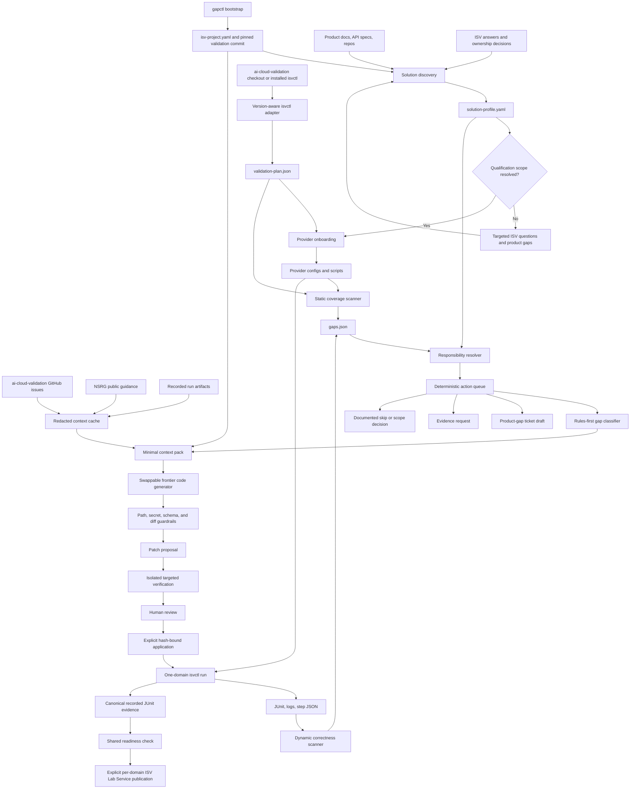

# Agentic Solution Architecture

## Objective

The full system helps an ISV qualify a versioned metal-to-model solution,
prepare its `ai-cloud-validation` provider implementation, execute validation,
and close actionable gaps with human-reviewed changes.

The project records reproducible validation evidence under `.gapctl/runs/`.
An explicit command publishes only locally complete, successful evidence to the
ISV Lab Service; publication never changes qualification scope or test outcomes.

## System View



Solid contracts through context collection, an explicit generator adapter,
guarded multi-file patch proposal, isolated static verification, transactional
hash-bound application/rollback, targeted and full-domain live verification,
persistent agent orchestration, canonical run recording, and explicit
completed-result publication are implemented. Built-in model-vendor adapters beyond the included
Codex and Claude Code reference adapters and PR submission remain optional
future integrations.

## Journey Stages

### Qualify

1. Identify the exact product and component versions.
2. Build the component dependency graph and map components to NSRG layers 1-4.
3. Identify actors: ISV, NCP, integration partner, NVIDIA, customer, and lab.
4. Set each domain and capability to `covered`, `gap`, `out_of_scope`, or
   `unknown`.
5. Separately choose `test`, `evidence`, `skip`, or `deferred` validation mode.
6. Record both capability ownership and provider-adapter ownership.
7. Resolve all required unknowns or document a gap-closure path before entering
   the validate phase.

An ISV owns one or many domains and is qualified and validated only for the
scope it owns (`owned: true`). Domains owned by other actors (deployment
partner, NCP) are recorded as external dependencies and never block the ISV's
own validation. Composing several validated single-owner profiles into an
integrated IaaS/CaaS/PaaS full-stack claim is a separate NCP/integrator concern
and is out of scope for a single ISV here.

Steps 4-6 can be agent-drafted instead of hand-authored. `gapctl catalog`
distills the pinned suites into the per-domain mapping target (checks, test
ids, steps) through the isvctl plan contract; `gapctl qualify-draft` packs
that catalog with the API spec, guidance, and latest recorded runs, then runs
a generator adapter against the solution-profile schema. The draft is
deterministically hardened — always `profile_status: draft` in the `qualify`
stage, domain set exactly equal to the declared scope, coverage `covered`
only with packed evidence — and drafted-covered domains whose latest recorded
run failed are reported as empirical conflicts. Ratification stays human: the
SME edits the draft (`gapctl profile --draft` shows the per-domain diff and
conflicts), sets `profile_status` to `reviewed` or `confirmed`, and advances
`journey.stage` to `validate`. The model proposes the mapping; it never decides
ownership or scope.

### Validate

1. Scaffold or discover provider configs.
2. Export the merged, schema-validated plan from the installed `isvctl`.
3. Run static coverage scanning.
4. Select one domain and execute or ingest its dynamic artifacts.
5. Resolve every row against the solution profile.
6. Apply one deterministic decision to each raw result: whether it blocks,
   whether a candidate edit is allowed, and which profile action owns it.
7. Fix and rerun one selected gap at a time until all required rows are green or
   have approved dispositions.
8. Record the final JUnit result under `.gapctl/runs/` and publish only when the
   reviewed profile, complete gap report, and latest run for every owned domain
   are ready.

"One gap at a time" means serial, reviewable changes, not stopping after one
gap. The controller eventually processes the full selected domain.

## Core Contracts

### Workspace Project

`isv-project.yaml` is the local root of trust for one engagement. It records:

- validation repository URL, requested ref, checkout, and resolved commit
- provider name, path, and new/existing discovery state
- the ISV-owned domains for this engagement
- provider API endpoints, API specification references, and credential
  environment-variable names
- declared local, web, and GitHub issue context sources
- live-run, cleanup, and retry policy

Bootstrap begins the qualify phase; the `journey.stage` field in the solution
profile (`qualify` then `validate`) tracks which phase the engagement is in. A
profile supplied at bootstrap must cover every owned domain. Validating the
owned scope green attests only to what the ISV owns — never to an integrated
metal-to-model stack, which requires composing multiple validated single-owner
profiles.

### Context Pack

Context collection and candidate generation are separate. Synchronization
always fetches declared network sources (an unreachable optional source
degrades to `missing`); generation consumes a local, redacted cache. For one
selected gap, the pack contains the current provider target/config, scanner
evidence, relevant API operations, bounded reference excerpts, the latest
recorded run artifacts for the gap's domain, and only the GitHub issues
matching the gap terms.

Source precedence is explicit:

1. Recorded run artifacts (`.gapctl/runs/<run-id>/`) as empirical evidence —
   observed runtime results override every declared source.
2. Installed validation contracts and provider-owned API specifications.
3. Provider source/configuration and approved reference implementations.
4. Public NSRG architecture guidance.
5. GitHub issues as advisory context.

Authoritative sources are never excerpted — the generator sees the whole
contract, bounded only by the pack budget. Reference and advisory sources are
relevance-excerpted and must match the selected scope to earn their budget.

Lower-trust sources cannot override scope, ownership, validation outcomes, or
allowed paths. Cache records and context items are hashed; common credential
assignments, bearer tokens, cloud keys, and private keys are redacted.

### Solution Profile

The profile answers what is being validated and who owns it:

- exact solution and component versions
- component dependency graph
- NSRG layers
- source references
- domain coverage
- validation mode
- capability selectors
- capability owner
- provider-adapter owner
- required ISV inputs
- qualification blockers

Capability selectors can match provider step, validation category, and
validation class. Equally specific overlapping selectors are rejected.

### Validation Plan

The plan answers what this installed test suite will do:

- config, catalog, and `isvctl` versions
- deterministic config/catalog fingerprints
- merged lifecycle steps
- every validation shape and repeated variant
- categories, phases, labels, and platforms
- execution-adapter routing such as ReFrame
- unknown or malformed entries

The supported machine boundary is:

```text
isvctl catalog list --json
isvctl test run -f <config> --dry-run --no-upload
```

This design tolerates suite iteration without importing private parser classes.

### Gap Report

`gaps.json` is flat deterministic truth plus optional enrichment. A row carries:

- domain, provider step, validation class, upstream test ID, and labels
- static or dynamic detection
- coverage or correctness stage
- status and evidence
- remediation target and exact rerun command
- optional profile responsibility and action

The profile cannot change a validation result. One shared policy combines the
raw status with the reviewed action:

- `pass` is non-blocking;
- `fail`, `error`, and `not_implemented` block unless an unowned capability has
  an explicit skip disposition;
- `skipped` blocks unless the profile explicitly says `skip_with_rationale`;
- generation additionally requires ISV ownership, a reviewed/confirmed profile
  in the validate stage, `implement_or_fix_adapter`, and a scanner-authorized
  target.

Gap schema `0.2.0` removed the old nullable milestone field because upstream
does not provide that contract. Existing workspaces regenerate `gaps.json`;
other project, profile, context, and workflow artifact versions are unchanged.

## Agent Actions

| Action | Meaning | Automated edit allowed |
| --- | --- | --- |
| `implement_or_fix_adapter` | ISV owns the provider adapter for a covered/testable capability | Only when the scanner also marks it fixable |
| `request_external_adapter` | Another actor owns the adapter or probe | No |
| `collect_evidence` | The agreed validation mode is evidence rather than execution | No |
| `record_product_gap` | Required capability is missing from the product solution | No; draft ticket/integration plan |
| `skip_with_rationale` | Capability is approved out of scope or intentionally excluded | No |
| `request_scope_decision` | Ownership, product coverage, or validation mode is unresolved | No |

## Guarded Fix Node

Only candidate generation needs a frontier model. The surrounding gate and loop
remain deterministic. The current generator seam is a candidate replacement
file supplied to `gapctl fix`; this allows human-authored, model-authored, or
tool-authored candidates to pass through the same policy.

The generator interface accepts a minimal context pack:

- one gap row
- selected provider script and config fragments
- expected JSON output schema
- matching validation metadata
- solution responsibility
- approved API/repository documentation
- a path pointer to the matching reference implementation (patterns only; its
  contents are never embedded, so generated code derives from the ISV's own
  spec and the executable contract)
- previous attempt and verifier feedback

The command adapter receives a JSON request on stdin, runs without a shell and
with an explicit environment allowlist, and must return one schema-valid change
set bound to the context-pack hash. The guardrail emits a combined unified patch
without modifying source. It requires the selected remediation target and
allows additional changes only under provider scripts, the selected domain
config, or the exact Kubernetes wrapper. The verifier
copies the provider into a temporary workspace, installs the candidate there,
rescans the selected static domain, and records selected-row status and
regressions in a hash-bound manifest. Transactional application requires an
explicit flag, rebuilds the proposal, compares every hash, stages all files,
creates backups, and restores already-applied files if the transaction fails.
The model never chooses the next gap, retry budget, allowed path, or merge
action.

### Live Verification and Agent Turns

#### Validation environment

Live validation runs against an environment NVIDIA provides, not one the ISV
stands up. In the AI Cloud Ready program this is **YTL**, a site in NVIDIA's
Forge Cloud platform giving API-driven access to GB200 reference-architecture
hardware; ISVs receive time-boxed (roughly four-week) access to this mini-cloud
through the ISV Lab program. In a solution profile this environment is the
`validation-lab` actor. The NCP/partner-supplied capabilities an owned domain
depends on (storage, identity, networking — the `deferred`/`unknown` rows owned
by a `partner` actor) already exist in that environment; the ISV points its
tests at them through `required_inputs` (for example a StorageClass name) rather
than implementing them. A partner-owned capability inside an owned domain
therefore stays a blocker until lab access resolves it, at which point the fix
is profile data (fill in the input, set coverage to `covered`), not ISV code.
DSX Air, by contrast, is a plumbing/workflow simulation and is not evidence of
provider qualification.

Live execution has three independent gates: a reviewed/confirmed solution
profile in the validate stage, reviewed project policy, and an explicit
`--run-live` invocation. The runner verifies the checkout still
matches the pinned commit, constructs the command from the supported `isvctl`
interface, passes only declared environment inputs, disables result upload,
redacts the captured log, and ingests JUnit back into the gap model.

For a selected validation class, the runner passes `-- -k <class>` to upstream
pytest. Upstream `isvctl` still executes its configured lifecycle, so targeted
selection does not bypass setup or teardown. If a newly applied transaction
fails live verification, the orchestrator restores it from the hash-bound
application record before considering feedback or stopping at a blocker.

`agent-run` advances one safe turn at a time. It may generate and statically
verify without approval, but pauses at `awaiting_review`. Exact patch-hash
approval authorizes one application. It then pauses at `awaiting_live` unless a
live run is explicitly authorized. A domain is `complete` only after static
selected scope is green and a final full-domain live run passes.

## Deterministic Loop

The implemented controller consumes successive `gaps.json` reports and records
explicit attempts in `loop-state.json`. It uses the same gap decision function
as auto, live success, status, and publication authorization; selects scope
blockers before edit routes; prefers editable and `min_req` rows within a route; enforces
a per-gap retry budget; and reports `ready`, `blocked`, or `complete`. It
deliberately does not execute remediation strings or apply patches. `agent-run`
orchestrates these existing decisions while preserving separate patch-review,
application, and live-execution gates.

The complete target state machine is:

```text
SCAN
  -> SELECT_NEXT_REQUIRED_GAP
  -> ROUTE
      -> QUESTION / EVIDENCE / TICKET / SKIP
      -> BUILD_CONTEXT
  -> GENERATE_PATCH
  -> GUARDRAIL
  -> HUMAN_REVIEW
  -> VERIFY_TARGET
  -> RESCAN_DOMAIN
  -> COMPLETE | NEXT_GAP | STOP_WITH_BLOCKER
```

Suggested stop conditions:

- selected domain has no unresolved required fail/error/not-implemented rows
- retry budget for the same gap is exhausted
- verifier regression outside the selected gap
- missing credential, environment, API contract, or ownership decision
- proposed edit escapes the approved path boundary
- human rejects or pauses the change

## Guardrails

- Never edit NVIDIA-owned suites, validation classes, catalog code, or engine
  code.
- Allow only provider scripts, the selected domain config, and the exact
  selected Kubernetes wrapper.
- Allow integration-manifest edits only for an explicitly approved
  `lib_adoption` task.
- Reject secret-looking material in prompts, patches, reports, and logs.
- Validate generated JSON output against the expected step schema before a
  dynamic run.
- Run the narrow targeted validation before the full domain.
- Verify candidates in an isolated copy before source application.
- Require explicit application authorization and bind it to verified hashes.
- Back up existing targets and apply atomically; never auto-merge.
- Keep credentials, private source, and execution inside the ISV environment.

## BCM and Mission Control Baselines

The included profiles are useful agent testbeds because current public
documentation gives concrete deployment and operations context.

BCM coverage is initially modeled around:

- bare-metal cluster provisioning and lifecycle
- Kubernetes integration
- Slurm scheduling and workloads
- infrastructure monitoring

Mission Control composes BCM with documented current components for autonomous
job recovery, autonomous hardware recovery, Grafana dashboards, LaunchPad, and
Kubernetes artifacts.

Neither baseline assumes that cluster management automatically equals a full
tenant cloud. Control plane, IAM, registry, SDN/VPC, storage, and suite-wide
security ownership remain explicit qualification questions until an integrated
solution supplies them.

## Implementation Map

| Capability | Status |
| --- | --- |
| Version-aware catalog and dry-run adapter | Implemented |
| Pinned workspace bootstrap and project contract | Implemented |
| Redacted context sync and bounded context pack | Implemented |
| Explicit generator command adapter and change-set contract | Implemented |
| Ephemeral schema-constrained Codex generator adapter | Implemented |
| Multi-file guard, isolated verifier, and transactional apply | Implemented |
| Validation plan schema/export | Implemented |
| Solution graph and responsibility schema | Implemented |
| BCM and Mission Control draft profiles | Implemented |
| Cross-domain provider onboarding | Implemented |
| K8s wrapper completion | Implemented |
| Static scan across current suite shapes | Implemented |
| Generic single-domain JUnit ingestion | Implemented |
| K8s setup and layer-aware dynamic classification | Implemented |
| Profile-aware action routing | Implemented |
| Candidate-file generator seam | Implemented |
| Provider-script patch guardrail | Implemented |
| Isolated static verifier and manifest | Implemented |
| Explicit hash-bound atomic application | Implemented |
| Persistent deterministic loop-state controller | Implemented |
| Explicit rollback and policy-gated live verifier | Implemented |
| Persistent review-gated agent runner | Implemented |
| Canonical recorded run evidence | Implemented |
| Direct per-domain publication to ISV Lab Service | Implemented |
| Wheel-packaged runtime schemas | Implemented |
| Additional model-vendor generator adapters | Optional next |
| Pull-request creation | Optional next |
