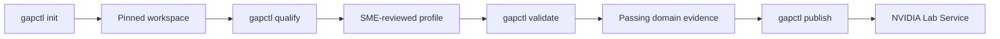
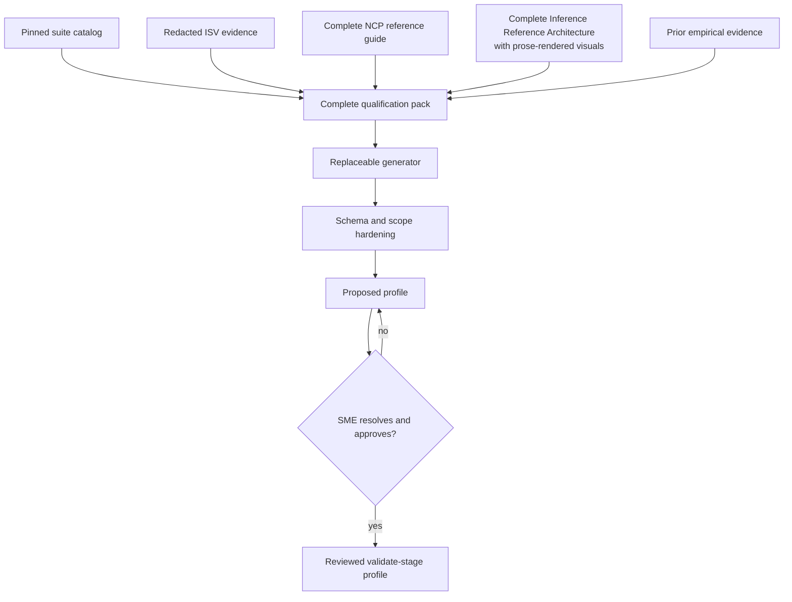
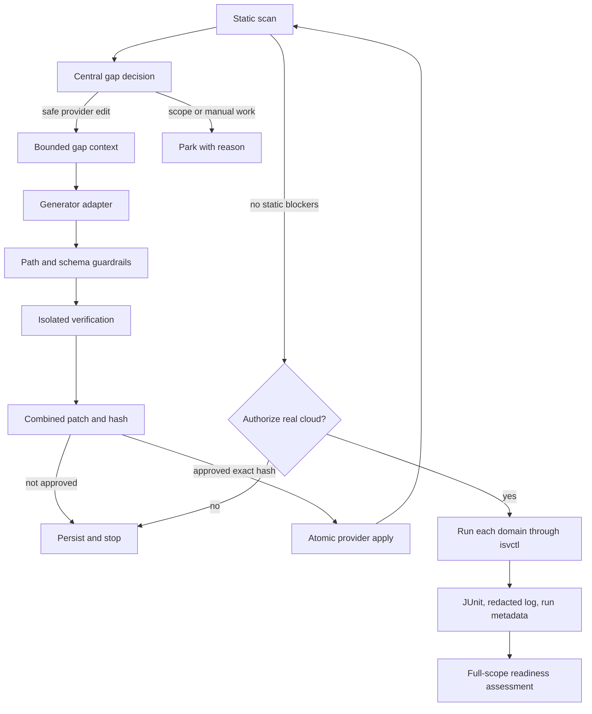

# Architecture

`gapctl` presents one product journey to an infrastructure ISV:

```text
init -> qualify -> validate -> publish
```

The implementation has multiple deterministic services because review,
verification, rollback, evidence preservation, and scope enforcement are safety
boundaries. Those services are not separate user workflows or public commands.

## Command ownership



### `init`

`init` owns all workspace bootstrap work:

1. validate provider, domain, optional API, arbitrary ISV context, and
   credential-name inputs;
2. validate and use a supplied `ai-cloud-validation` checkout as-is, or clone
   it when absent;
3. resolve and record the exact validation commit;
4. build the per-domain suite catalog through the installed `isvctl` contract;
5. preserve an existing provider implementation, or scaffold provider-owned
   files when absent;
6. import declared context into the redacted cache;
7. create the initial draft profile.

Source configuration has one owner: `isv-project.yaml`. The solution profile
does not repeat source URLs, paths, kinds, trust levels, or import settings. It
contains only `source_refs` and `evidence_refs` citation IDs. During
qualification, the deterministic boundary resolves every citation against the
exact packed evidence items before a proposal can be approved.

The cache index is bound to both the declared source configuration and the
current bytes of local sources. Provider-interface metadata is optional and is
stored under `interfaces`, whose supported kinds are `rest`, `graphql`, `cli`,
`sdk`, `kubernetes`, and `other`. `--api` is the REST bootstrap shortcut rather
than the name of the general model. Repeatable context
inputs accept a local file, a local text-document tree, or an HTTP(S) page and
are recorded as required, authoritative ISV evidence. If an ISV edits a local
API specification or qualification document before proposal generation,
`qualify` refreshes that source instead of sending stale evidence to the
generator. This freshness check never performs hidden network requests.

A fresh clone obtains the current head of the selected ref. Once recorded, the
commit is stable for that qualification. Later commands reject checkout drift
instead of silently pulling different tests into an active engagement.
An explicitly supplied checkout is never fetched, switched, or rewritten by
bootstrap; its current `HEAD` is the commit recorded in the project.

### `qualify`

`qualify` is a resumable human decision:



The generator maps capabilities explicitly declared by the ISV to the closest
applicable pinned checks and can suggest component mappings, coverage, and
ownership. An API specification is authoritative for the interfaces the ISV
declares, not proof that those interfaces work. The deterministic layer forces
the proposal to remain a qualify-stage draft and requires its domains to equal
the domains declared during `init`. It also resolves profile citations against
the exact qualification-pack `source_id` values; the profile cannot redefine
their locations or trust. The SME edits the proposal when facts are unresolved.
Only an explicit approval promotes the reviewed document.

Schema, reference, exact-domain, and component-graph failures are returned to
the next bounded qualification pass in a compact, redacted failure envelope.
Repeated normalized failures and exhausted retry budgets park qualification;
an invalid proposal is never persisted.

Before approval, the CLI displays both the domain-default diff and effective
pinned-check counts. Each catalog check is resolved through the profile's
step, validation-category, and validation-class selectors. The resulting
per-domain and total `covered/test`, `out_of_scope/skip`, and other counts make
partial-domain capability exceptions visible even when the domain default is
skipped.

Qualification receives the complete NCP Software Reference Guide collection
published in NVIDIA's documentation index and the complete NVIDIA Inference
Reference Architecture. Both are required for every ISV; no offering flag or
automatic capability inference controls their inclusion. The reference-guide
collection is accepted only when every indexed guide page is fetched. The
Inference Reference Architecture keeps its original Mermaid source and appends
a deterministic prose rendering of every visual's nodes, groups, and
relationships. Suite catalogs, authoritative ISV evidence, and both reference
sources are never silently shortened. Qualification imposes no separate
character limit; the selected generator's declared byte capacity is checked
against the complete serialized request before invocation. GitHub issues are
not a supported qualification source.

The profile is deliberately small:

- a `covered/test` domain default is allowed only when ISV evidence maps every
  check in that pinned domain catalog;
- partial domains use grouped capability entries for explicitly mapped checks
  instead of silently treating unmatched checks as covered;
- grouped selectors require evidence for every selected check's actual behavior;
  nearby terminology is not a capability match;
- selectors account for both the provider step and validation class; a
  class-only selector is valid only when every occurrence of that class is
  supported;
- an `out_of_scope/skip` partial-domain default requires evidence that every
  unmatched check is outside the product claim; otherwise it remains an SME
  decision;
- `covered/test` means the capability exists and should be tested;
- `out_of_scope/skip` is an explicit reviewed scope decision;
- `unknown`, `gap`, `evidence`, and `deferred` block entry into validation.

Missing live evidence does not by itself make a declared capability unknown.
Qualification routes it to `covered/test`; validation determines whether the
target implementation passes. Numeric `nsrg_layers` are omitted unless a source
explicitly provides that numbering because the current NCP guide describes
IaaS, CaaS, and AI PaaS by name.

Provider implementation gaps do not belong in the qualification profile. A
domain may be `covered/test` while its provider adapter is incomplete; the
scanner records that implementation gap during `validate`.

### `validate`

`validate` owns the complete code-and-test loop for every declared domain:



The central decision in `decision.py` is the only interpretation used by
generation, readiness, and publication. It returns:

- whether the row blocks readiness;
- whether a generated provider edit is eligible;
- the required action;
- the reason for that decision.

Generation requires all of the following:

- the profile is reviewed or confirmed and in the validate stage;
- the domain is declared and ISV-owned;
- the domain or capability resolves to `covered/test`;
- the scanner marks the row safely auto-fixable;
- the target is inside the provider-owned allowlist.

File-oriented scanning is not allowed to make the terminal completeness
decision by itself. Once deterministic edit-eligible rows are exhausted,
`domain_audit.py` performs one read-only, schema-bound audit over every approved
`covered/test` capability, the complete domain source inventory, the reviewed
profile, and the source context already used for remediation. Every approved
capability must appear exactly once. An `implemented` result must cite supplied
provider code; a `gap` must select an existing provider-owned target and is
converted to a normal `semantic` gap row. That row uses the existing change-set,
scope, isolated static-regression, retry, scratch, and review controls. A
successful semantic candidate receives one post-change audit; unresolved
findings are parked instead of creating an unbounded review loop.

The audit does not execute provider APIs and is not an intent/cassette or live
gate. It closes the narrower orchestration hole where a generic inventory or
no-op scaffold prevented the remediation model from being called at all.

The scanner orders rows from the normalized execution plan: declared phase
order, then provider step order. Suite-required steps that are not wired into
the provider yet retain upstream validation order within their phase. The
generation loop preserves that order instead of introducing a separate target
priority heuristic.

Skip decisions remain visible regardless of where the provider encodes them.
The static scanner reports both command-level `skip: true` configuration and
literal `skipped: true` or validation-specific `*_skipped: true` fields emitted
by provider scripts. Such rows are resolved only when the reviewed profile
routes the exact checks to `out_of_scope/skip`; executable diagnostics do not
turn an unreviewed skip into passing evidence.

The generator never writes the provider directly. It returns a schema-valid
change set bound to the context pack hash. Verification applies the change in a
scratch copy and rescans it. The operator sees one combined patch per domain.
Application recomputes the patch and refuses any hash mismatch.
Callable adapters execute from an empty temporary working directory. Before and
after every successful, failed, or timed-out adapter call, gapctl fingerprints
the manifest, reviewed profile, provider tree, validation tree, and any active
scratch provider. A direct mutation outside the JSON response is a guardrail
failure and the candidate cannot advance to review or application.
Scaffolding keeps every generated domain config inside the provider directory,
including `config/kubernetes.yaml`, so scratch verification and atomic apply
operate on one complete provider-owned tree. The scanner and live runner can
still read an older sibling Kubernetes wrapper for compatibility.
Declining the patch removes only its generated review markers; the next
validation run replaces the scratch copy from the unchanged provider and
generates a new candidate rather than resuming the rejected review.

The generator boundary is a versioned stdin/stdout protocol rather than a
Codex- or Claude-specific workflow. Built-in aliases resolve to the packaged
reference adapters. A local operator configuration may register any adapter
command, explicitly allow environment-variable names, and declare total/idle
deadlines and maximum request bytes. An executable path can be selected
directly. When no callable adapter exists, file exchange exports the identical
complete request and imports one JSON response through the same schema, hash,
scope, static-verification, and human-review guards. Validation imports at most
one candidate before producing a review, so a pause between external-agent
turns cannot discard staged work.

Generator requests also carry one repository-pinned `isv-readiness-agent`
skill and its content hash. The skill provides a concise, phase-specific
reasoning workflow while request rules and deterministic guardrails remain
authoritative. The Codex adapter stages the packaged skill in its isolated
workspace; other adapters consume the same embedded instructions. No ambient
personal skill is required or trusted.

Each generation pack includes the exact declared runtime environment names and
the other edit-eligible unresolved validation rows in the selected adapter
contract unit. Checks share a unit when they use one script. Rows whose target
is a YAML configuration file share a unit only when their step name also
matches; unrelated steps commonly live in the same domain file and must remain
independent decisions. A compact domain-lifecycle item preserves every configured
setup, test, and teardown step in execution order. The complete domain config,
the selected and existing setup/teardown scripts, and provider-shared helper
modules are supplied as authoritative provider context. Edit authority remains
bounded to the selected adapter contract, but generation can see the surrounding
resource ownership and data flow instead of treating one file as an isolated
program. The pack also includes the exact relevant entries from the pinned
suite, the step-output schemas, and a deterministic AST projection of
the validation classes that consume those outputs. That projection retains
method signatures, documented inputs, keyed data access, exact branch
conditions, pass/fail outcomes, direct dependencies, caught exceptions, source
line ranges, source hashes, and explicit unresolved dynamic behavior. Complete
consumer files remain at their pinned paths instead of being copied into every
model request. When a direct dependency resolves uniquely to a local helper,
the pack adds that one bounded function source as exact evidence; lookup does
not recurse through an unbounded call graph. Provider-authoring rules live once
at the generator task boundary instead of being duplicated inside the evidence
pack.

Provider-neutral authoring rules require source-grounded interfaces, one
canonical resource identifier across configured lifecycle steps, verified TLS,
bounded timeouts, structured result fields, and no raw provider output in
evidence. The rules also require the documented semantic contract to be honored
even when an executable assertion is weaker; provider-native concepts may be
mapped to contract primitives only when the supplied evidence establishes that
mapping. Provider-derived subprocess arguments are treated as untrusted, and
absent optional response fields are not allowed to override required state
fields implicitly. The reviewed profile mapping is an approved implementation
premise: a declared response variation is handled by bounded parsing and
explicit runtime failure rather than by reopening qualification scope. Standard
verified client behavior may implement an established access flow without
inventing provider credentials or success. Interactive consoles and shells are
treated as sessions: a probe must use source-backed readiness evidence and
terminate cleanly instead of waiting for a healthy session to exit naturally.
The agent must reuse suitable existing provider transport, routing, polling,
inventory, and client primitives; cite the source for every wire mapping; and
restore relevant starting configuration and health after mutating tests when
safe. Existing command paths require evidence that their executables and route
match the declared interfaces and runtime inputs. Target identity remains in
the reviewed solution profile, while actual preflight and live execution prove
whether the configured route works. The project does not use a free-text route
sentence as a readiness gate.

Retry accounting uses the same contract unit, so several checks backed by one
adapter cannot multiply the model budget or consume another step's retries.
Static and live retries share a deterministic failure envelope: expected and
actual behavior, the stable redacted error, one representative excerpt for each
normalized root cause, affected check identities and counts, and hashed
references to retained artifacts. Volatile timestamps, UUIDs, labeled
request/resource/operation IDs, and poll counters do not create false-new
fingerprints.

The generator is retried only when the scanner, reviewed profile, and observed
failure all support a plausible edit to an approved provider target. Conflicting
ownership evidence routes to the existing scope-decision gate. Missing or
ambiguous diagnostic evidence, a repeated normalized fingerprint, or the
configurable `execution.max_failure_groups` ceiling parks regeneration for
triage. Model and transport failures remain infrastructure errors outside this
repair state. Compact feedback never replaces the complete artifacts.

Live success additionally parses the emitted JUnit XML directly and rejects
every explicit `failure` or `error`, including injected subtests. Process exit
zero, PASS text, scanner grouping, and testcase naming cannot override that
deterministic result.

The remediation pack preserves every selected source whole. The selected
adapter's declared complete-request byte capacity is the only size gate;
sibling rows are represented by their validation contract fields rather than
duplicated scanner metadata.

Deterministic candidate checks enforce what can be established without knowing
the provider: environment references in each changed candidate must be declared,
insecure TLS patterns are rejected, and a direct authenticated Python transport
must parse and validate its base URL before attaching credentials. That URL must
use HTTPS, contain a hostname, and omit userinfo, query, and fragment components.
Recognizable delete/teardown adapters must treat a documented already-absent
outcome as success; multiple independent deletion actions cannot share one
fail-fast try block and must expose a `cleanup_errors` aggregate. Raw
Python candidates that call `exec`, `eval`, or `compile` are rejected so their
behavior cannot be hidden from static review. Credential-bearing `curl` or
`wget` calls are rejected in generated shell lifecycle scripts; they must use
the same guarded provider-shared client boundary as Python adapters. Raw
response/console fields cannot enter
result JSON, a recognizable result mapping cannot omit or leave empty an output
consumed by a later configured step, and an explicit internal deadline cannot
exceed its configured step timeout. Dynamic result construction remains a human
review concern when static proof is not possible. When an authoritative API
specification declares a machine-readable lifecycle timeout, the changed
lifecycle adapter's runner timeout and explicit internal recovery deadline
cannot be shorter than that source-backed threshold.
For an existing domain YAML configuration, removing the selected step block
from the original and candidate must leave the same surrounding text. This
permits a coordinated step wiring or timeout change while rejecting whole-file
formatting, comment deletion, and changes to unrelated steps.
Provider-specific semantics that cannot be inferred safely from code, such as
which documented identifier an endpoint accepts, remain a source-grounded
generation requirement and an explicit human-review concern. When the supplied
provider interfaces cannot satisfy the pinned contract within the edit boundary,
the schema permits an empty change set carrying the exact blocker; the target is
parked instead of forcing fabricated code. Static rescan success is therefore
labeled as static verification, never as runtime proof.

Lifecycle semantics remain literal. A create, launch, provision, delete, or
teardown step cannot be implemented as a read-only check of a pre-existing
resource; when the declared interface lacks the corresponding operation, the
generator must park it.

Lifecycle completeness remains downstream of reviewed scope. API evidence can
prove that a provider exposes a Slurm plugin or cluster operation, but it does
not choose whether the engagement validates an adapter-managed resource or a
pre-existing one. The domain audit treats the reviewed rationale and ownership
as premises and returns `scope_question` when the supplied sources genuinely
conflict; it may not infer ownership from comments or provider operation names.
The audit reuses the normal whole-domain context pack rather than carrying a
second copy of the scan and provider source. A small relative-path index binds
citations to those packed sources, and all iterative passes read the isolated
scratch provider that contains the current candidate.
If repeated provider experiments show the need, a later profile revision can
add a small reviewed resource mode (`adapter_managed`, `preexisting`, or
`external`). That is not required by the first audit implementation.

Connection topology is part of that structural comparison. A jump host, proxy,
or gateway cannot be substituted for the resource that an upstream check tests
directly. When provider evidence requires an intermediate hop but the pinned
consumer exposes no compatible proxy input, the generator must park the shared
adapter contract instead of claiming direct reachability. Human review remains
the final semantic gate because arbitrary ISV specifications do not share one
safe machine-readable topology shape.

A non-empty change set must include the scanner-selected remediation target,
but that target is not the whole edit boundary. The generator may also include
other provider-owned scripts and the selected domain configuration when the
same adapter contract requires coordinated wiring or timeout changes. The
existing path, hash, candidate-content, and isolated-rescan guards apply to
every included file.

The packaged Codex adapter uses one schema-constrained call with a 1,680-second
deadline. The packaged Claude adapter owns up to two schema-correction attempts
of 840 seconds each. These attempt counts are adapter behavior, not a universal
workflow limit. The default outer adapter deadline is 1,800 seconds; a local
registration may increase it, within the eight-hour safety ceiling, and may
add an idle deadline refreshed by adapter output. All deadlines also expire
across macOS sleep.
Timeout, Ctrl+C, and SIGTERM first give an adapter a short cleanup window so it
can reap a nested model session, then force-kill and close inherited pipes if
cleanup does not finish. A model timeout stops the run as generator
infrastructure failure; it does not consume provider retry attempts or launch
the identical request again. Built-in adapter names resolve beside the running
`gapctl` executable first, which prevents mixed tool versions when another
installation is also on `PATH`.
Generator children receive only the minimal process environment, explicitly
declared generator inputs, and the non-secret `USER` identity needed for macOS
Keychain-backed CLI authentication. Authentication material itself is neither
forwarded explicitly nor added to context.
Before invocation, the core compares the complete serialized request with the
adapter's declared byte capacity. An incompatible adapter fails clearly without
receiving a shortened request. Remediation context has no separate aggregate
character ceiling: every selected source is preserved whole, just as it is for
qualification, and the adapter-capacity check remains the single size boundary.

`validate` invokes live execution one domain at a time internally, while the ISV
runs one command for the entire owned scope. The explicit confirmation is the
public live-run authorization. A transient authorized project is passed to the
internal runner, so the operator does not edit a YAML policy toggle.
The live `isvctl` process also runs inside the shared captured-subprocess
boundary. Timeout, Ctrl+C, and SIGTERM therefore reap provider-script children
before the CLI exits, using the same bounded graceful-then-forceful cleanup as
generator adapters.

Before invoking `isvctl`, the live runner deterministically derives an exclusion
overlay from the reviewed profile. A validation name is excluded only when every
configured occurrence resolves to an approved skip action; if the same validation
class is in scope for another step, it remains active and the provider step wiring
controls that occurrence. The overlay is stored with the run artifacts and passed
after the provider config, so it does not modify the pinned suite or provider files.

Each live domain produces:

```text
.gapctl/runs/<run-id>/
├── run.json
├── junit.xml
└── isvctl.log
```

When a later domain runs, current static rows are rebuilt and existing dynamic
rows for other domains are retained. This prevents a multi-domain engagement
from losing earlier successful evidence.

### `publish`

`publish` performs no qualification or remediation. It consumes the canonical
local state only after the shared readiness assessment confirms:

- a reviewed validate-stage profile;
- a current full-scope `gaps.json`;
- no blocking decisions;
- a successful recorded live run and valid JUnit XML for every owned domain;
- an `ai-cloud-validation` checkout matching the pinned commit.

After those local checks, it obtains a Lab Service token and creates one typed
test run per owned domain. There is no intermediate bundle or user-selected
JUnit path.

## Trust order

Conflicts are resolved in this order:

1. pinned `ai-cloud-validation` source, schemas, suites, and test results;
2. recorded empirical run evidence;
3. authoritative ISV context, any API specification, and the provider-owned
   implementation;
4. NVIDIA reference providers as patterns, not universal truth;
5. NVIDIA Software Reference Guide material;
6. explicitly supplied, approved advisory material.

No advisory source can override an executable validation contract or a recorded
runtime result.

## Credential boundary

Durable project data contains environment-variable names only. `--auth`
declares required credential inputs and `--input` declares required non-secret
runtime inputs. At runtime, `validate` requires those names to be set and passes
only them, injected API endpoint names, and a small process allowlist.
Publication uses a separate set of Lab Service environment variables.
Generator requests, proposals, patches, and project files must never contain
credential values.

## Internal module map

The main internal services are:

- `project.py`: workspace bootstrap and pinned project contract;
- `context.py`: redacted context import and bounded packs;
- `failure_feedback.py`: shared redaction, stable failure identity, and artifact references;
- `qualify.py`: suite catalog and profile drafting;
- `solution_profile.py`: scope contract and responsibility resolution;
- `scan/`: static and dynamic evidence extraction;
- `domain_audit.py`: scope-complete semantic review and audit-gap conversion;
- `decision.py`: centralized blocking and edit eligibility;
- `generation.py`: replaceable generator boundary;
- `changes.py` and `change_verification.py`: guarded proposals and application;
- `auto.py`: scratch-copy generation and hash-bound review state;
- `live.py` and `runs.py`: real execution and canonical evidence;
- `readiness.py`: shared validate/publish gate;
- `publish.py`: Lab Service authentication and typed evidence upload;
- `journey.py`: orchestration behind `qualify` and `validate`;
- `cli.py`: the four-command parser only.

These modules remain directly unit-tested. They are implementation boundaries,
not an alternative CLI surface.
